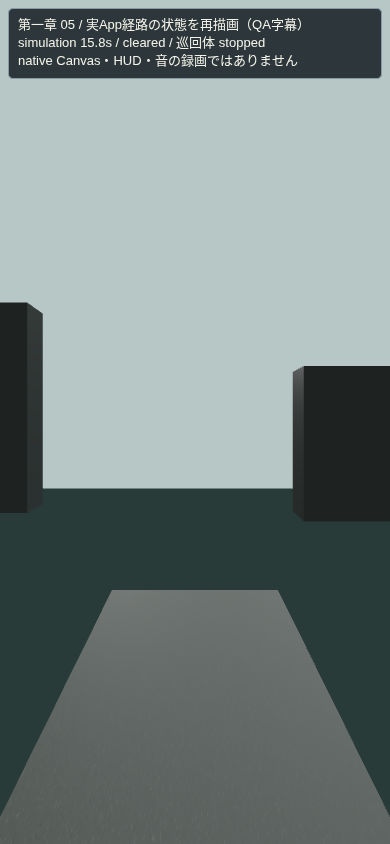
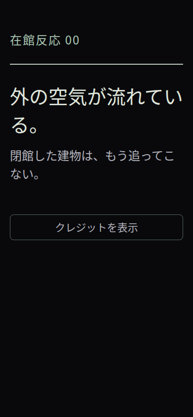
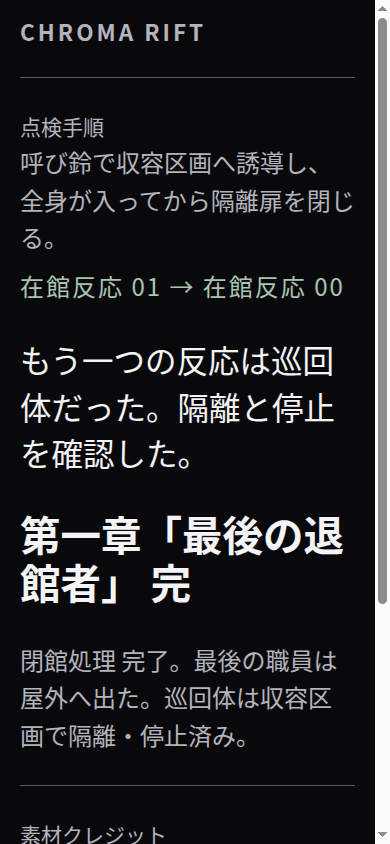

# Goal 014.1 — App の5エリア経路と結末

修正後の実際の `App` を1回mountし、その配下の5つのcontrollerで自然な移動・操作を実行した。章の進行を保存するApp処理まで通し、各エリアの状態を実際の `ChapterScene` で再描画した。全5エリア完了、同時Canvas境界1、unmount後0、経路内の位置・時刻検査が成功した。

| 動画 | 元動画のフレーム | 長さ |
|---|---:|---:|
| [01 → 02 → 03](01-to-02-to-03.mp4) | 0–576 | 115.4秒 |
| [04 → 05 → 屋外 → 結末](04-to-05-to-ending.mp4) | 577–808 | 46.4秒 |
| [全編](chapter-one-app-scene-replay.mp4) | 0–808 | 161.8秒 |

動画は390×844、5fps、音声トラックなし。779個の経路状態と、実Appの余韻・完了画面2枚を各3秒保持した30フレームを含む。分割動画は元動画の該当フレームを再符号化したもので、新しい場面や音を加えていない。[媒体検査](media-probe.json)でフレーム数と映像だけの構成を確認した。

04のキー取得、歯止め1段・3段、脱出、05のキー接続、手順、隔離、停止、屋外通過は[動画レポート](video-report.json)の順序検査に対応する。屋外通過は元動画757フレーム目、余韻は779、完了画面は794から。最後の屋外区間も実際のcontroller状態を使用する。

これは**端末で遊んだ画面の直接録画ではない**。移動・操作は検証用経路からcontrollerへ入力し、12更新ごとと操作・入退出の状態を抽出する。操作直後の追加フレームはゲーム内時間を進めない。ゲーム中のHUDはQA字幕に置換し、3Dシーンは進行の変化に応じて43回再構成する。字幕の内部状態名は検証動画専用で、製品の通常HUDではない。鏡は同じ巡回体と実際の反射処理を用い、18フレームで反射を描画した。

App内の保存はメモリー上のAsyncStorageを使う。Canvas準備完了・音声は代替で、音設定も無効。QAが実際に到達したcheckpointを使って `onValidatedEntry`、`onCheckpoint`、`onComplete` を呼ぶため、native提示後の完了通知タイミングや音ownerの受け渡しの証拠にはならない。音声のApp接続は別の回帰テスト記録を参照する。この経路にはpause/resume・直接再開の操作は含まれない。

余韻から完了画面へは実Appの「クレジットを表示」ボタンを操作し、得られた実際の2つの画面ツリーを文字倍率1.5のブラウザーCSSで描画した。3秒の保持は動画編集上の時間であり、製品の12秒タイマーの計測ではない。完了画面の下部はスクロールで読む。[元のApp画面データ](host-animation.json.gz)を上書き前のbytesのまま圧縮保存している。

対応する証拠：

- [App遷移・保存・代替の範囲](host-report.json)、[1,533個の位置と状態の記録](motion-trace.json.gz)
- [描画と解放の結果](webgl.json)、[779フレームの描画負荷](render-frame-metrics.json.gz)、[終了2画面の部品計測](ending-card-metrics.json)
- [全体の見本画像](chapter-one-app-scene-replay-contact.png)、[取得ログ](capture.log.gz)
- [ファイル・フレームのSHA-256一覧](manifest.json)。225個のApp読み込みソース、120個の描画読み込みソース、5個の検証ツールを取得後・掲載時に現在のファイルと照合した。両ソース群には重複がある。大きな状態JSON、43シーンJSON、809枚の元画像は `.expo/goal014-1/app-replay` に残し、ハッシュを一覧に記録した。

SwiftShaderのCPU時間はiPhoneのFPSではない。ブラウザーエラー0、シーンgeometry残留0。Threeが保持するDFG_LUT texture1個は既知のライブラリ所有分。iPhoneでの音声出力、native EXGL/Yoga、指操作の評価は別途必要。

再現：

```sh
node scripts/qa-chapter-app-replay.cjs --out=.expo/goal014-1/app-replay
```




