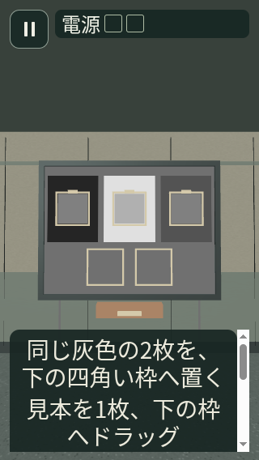
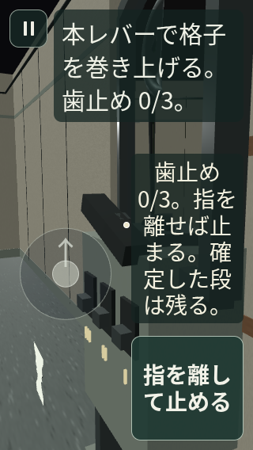
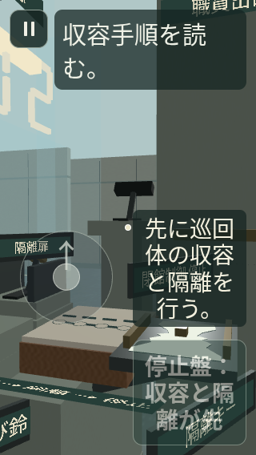

# Goal 014.1 — 5エリアのシーンと日本語 HUD

凍結した修正後ソースから新しく取得した **102 条件が成功**。320×568 / 文字倍率2、390×844 / 1.5、430×932 / 1 の3組を、標準・低品質の両方で確認した。各条件は実際の `FirstPersonScreen`、controller、`ChapterScene` を使用する。

- [全条件の結果](report.json)：操作ボタン44px以上、ボタン文字の範囲、HUDの重なり、実描画、12回の鏡反射、全102シーンの解放を検査。ブラウザーエラー0、シーン所有のgeometry/texture残留0、renderer解放後program0。
- [対応表とハッシュ](manifest.json)：掲載28画像、レポート・ログ、ローカルに残す全102画像＋102シーンJSONの SHA-256。174読み込みソースと4検証ツールのハッシュは取得後・掲載時に現在のファイルと照合した。
- [取得ログ](capture.log.gz)：既知のReact test renderer非推奨警告と鏡テクスチャのJSON転送警告を保存。反射はブラウザー側で実際の `planarMirror.ts` から再構成して検査した。

画像の選択は、文字倍率2の全17状態、文字倍率1.5と1の各5エリア入口、低品質の鏡保持1状態。装置を開く・鏡のレバーを保持する・隔離キーを差す・手順を読む操作は、実際のHUDボタンからcontrollerへ通している。05の条件不足と接続済みの無効ボタンも含む。

これは視点を固定した比較用の検証で、自然な歩行経路の録画ではない。04/05はcodecを通したcheckpoint、01の影装置と04の保持視点は明示した安全な立ち位置を使う。ブラウザーCSS/SwiftShader、Canvas準備完了と利用不可音声の代替を使用しているため、native Yoga/EXGL、iPhoneの文字の読みやすさ、指操作、音声出力、端末性能の合格判定には使わない。Threeのモジュールが保持するDFG_LUT 1個・1KiBは、シーン所有分から区別してレポートに記載している。

再現：

```sh
node scripts/qa-stage-scene-hud.cjs --out=.expo/goal014-1/stage-scene-hud
```




