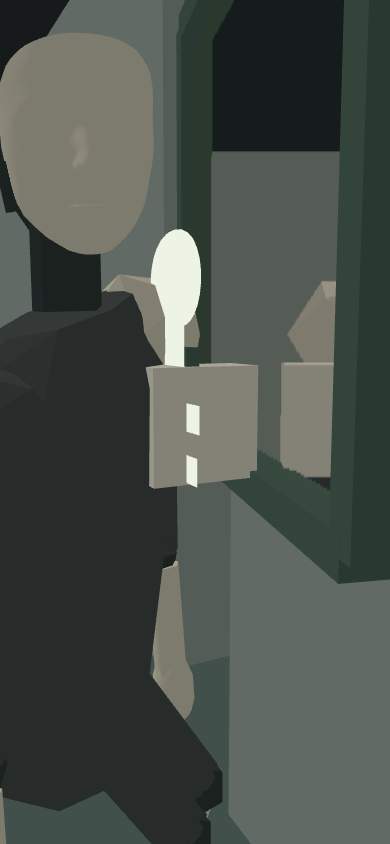
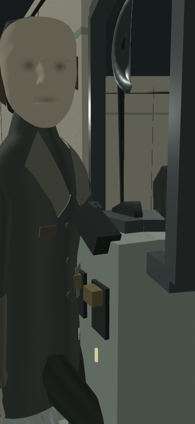

# Same-input area04 / area05 comparison

These clips execute the same literal controller operations against baseline `3632675e5c42ac252cca433a5e6dd45bb028f8c5` and the Goal014 implementation. Both areas reach `cleared` in both versions. The current loaded source and asset hashes were rechecked against `f20801e`; all matched. This supplements the separate [natural five-area route](../README.md) and [matched static scenes](../matched/README.md).

| Area | Silent side-by-side, baseline left | Baseline with its own audio | Goal014 with its own audio |
|---|---|---|---|
| 04: practice, held work, retreat, three teeth, passage | [28.6 seconds](area-04-paired-silent.mp4) | [Before](area-04-before-sound.mp4) | [After](area-04-after-sound.mp4) |
| 05: key, call, isolation, stop, staff exit, outdoor walking | [25.0 seconds](area-05-paired-silent.mp4) | [Before](area-05-before-sound.mp4) | [After](area-05-after-sound.mp4) |

The sound movies use separate matching audio tracks so the two mixes do not overlap. They crop the corresponding half of the paired scene movie. H.264 video is 390×844 at 5 fps; audio is stereo AAC at 44.1 kHz. All four contain the exact 143/125 source frames. Decoded true peaks range from −27.16 to −22.16 dBTP, with zero clipped samples. These are technical measurements, not a listening approval. The [audio/video report](audio-video-report.json) records individual measurements, input hashes, mux commands and durations.

## What is held equal

- One compressed, byte-identical [area04 operation tape](tape-04.json.gz) and [area05 operation tape](tape-05.json.gz) is consumed by both versions. Commands include target IDs, pointer IDs, fixed view deltas, movement and each `dt`. There is no state-dependent navigation, conditional retry, or mid-run pose/progress injection.
- Both checkpoint codecs accept the declared initial checkpoint. Area04 starts at its shared fresh spawn. Area05 starts with the carried key at the compatible legacy control-entry pose `(-3.75, 1.6, 10)`, yaw `π/4`, pitch `atan2(-0.2, √2)`. This is a declared section start, not evidence of the current natural arrival route.
- Both use standard quality, subdued intensity, the same 390×844 camera, vertical FOV 65°, near/far 0.08/60, and the same 5 fps observation schedule. The controller simulation advances at authored steps of at most 1/60 second. Reduced motion, assistance and low quality are false in these scene captures.
- Attempts at both old and new control locations are part of the shared tape. Refused commands remain in the reports; they are not replaced with successful commands. Area04's baseline mirror inspection is refused, whereas the current one is accepted. Area05's current outdoor press is refused because physical walking has already triggered completion; the baseline accepts that explicit press.

Every sampled player/camera pose in area04 matches within `1e-6`. In area05 the first camera difference is frame 103, video 20.6 s / simulation 20.607364 s: the old completed controller stops walking at `z=22.45`, while the current four-second aftermath permits the same forward input to reach `z=25`. The preceding 103 samples have matching player/camera poses. The 22 differing samples are preserved as the intended behavior change. [Comparison report](comparison-report.json) contains the numerical differences and per-frame main/offscreen render counts.

The actor runs independently against each version's actual world. Actor poses and phases can differ; identical input does not imply identical enemy trajectories. This is why the mirror's equal-actor visual probe below is a separate fixture.

## Useful points in the clips

Times here are video times. The subtitle also displays the recorded simulation time.

| Area | Time | Evidence |
|---|---:|---|
| 04 | 6.8–7.6 s | Real practice hold starts and ends. |
| 04 | 11.2–13.2 s | Held winch operation reaches the first tooth at the shared authored `WINCH_SAFE` position `(-1.8, 1.6, 10)`. [Holding still](stills/area-04-frame-058.png). |
| 04 | 13.2–14.6 s | Release, physical retreat and return retain tooth 1. [Retreat still](stills/area-04-frame-068.png). |
| 04 | 16.6 / 18.6 s | Teeth 2 and 3 become visible in the sampled controller state. [Second-tooth scene](stills/area-04-frame-085.png). |
| 04 | 19.6–20.2 s | Explicit mirror look/inspection attempt. [Mirror view](stills/area-04-frame-098.png). |
| 05 | 8.2–9.8 s | The two authored control locations accept successive attempts in the same tape; the real door closes and completes containment. [Closing scene](stills/area-05-frame-041.png). |
| 05 | 10.8–13.2 s | Power-stop attempts, the current staged body shutdown, then staff-door command. [Shutdown scene](stills/area-05-frame-056.png). |
| 05 | 15.0–20.4 s | Continuous physical walk toward the outdoor threshold. [Exit approach](stills/area-05-frame-075.png). |
| 05 | 20.6–24.6 s | Identical forward input produces the intentional completed-tail movement difference. [First differing sample](stills/area-05-frame-103.png), [continued outdoor walking](stills/area-05-frame-110.png). |

The final appended observation in each recorded movie has a QA phase-caption fallback of `entry`. It is still the completed final state, not a reset or splice; both exact state reports retain `cleared`. The promoted reproduction script corrects this caption fallback. The exact original authoring bytes used for these files remain in `authoring/`.

## Actual actor contribution through the mirror

An extra read-only pixel probe hides the sole real actor **only for one reflection pass**, restores it before the main draw, then measures changed canvas pixels above RGB-sum difference 12. It never advances simulation. The normal comparison movies contain the normal visible actor.

The [unaltered-tape probe](reflection-contribution.json) finds reflected actor pixels in 6 baseline samples (maximum 3,648) and 0 current samples. A successful offscreen render alone would therefore be insufficient to claim that the actor is visible in the current mirror at those particular trajectory samples.

To distinguish trajectory from art obstruction, the separate [matched-actor probe](matched-actor-probe/report.json) renders **both actual ChapterScene versions at baseline frame 85's same camera, progress and actor motion pose**. It does not execute or claim an additional controller route. The current-only gate-lift clock is set to the settled second-tooth height. Camera: `(-1.8, 1.6, 10)`, yaw `2.677945`, pitch `−0.136745`; actor root: `(-2.194687, 0, 11.349090)`, yaw `0.872888`. The actor is directly visible at the left of both main views. Its reflected arm/coat is also visible in the mirror at the right, with **3,044 changed pixels before and 2,465 after**, and zero GL errors.

| Baseline: same real actor pose | Goal014: same real actor pose |
|---|---|
|  |  |

This establishes real actor reflection with the current winch/mirror art at the shared working pose. It does not turn the current natural trajectory's zero reflected pixels into positive observations. The two frozen scene serializations are retained as `matched-actor-probe/before.json.gz` and `after.json.gz`.

## Evidence boundary and provenance

This is actual controller, actual `ChapterScene`, actual actor/door/gate callbacks, actual planar reflection and actual audio-owner commands. Presentation success and already-loaded players with zero-latency seek are explicit fixtures. Scene rendering uses Chromium software WebGL; the captions are QA overlays, not native HUD. Audio is reconstructed offline from the recorded owner operations and the respective version's actual assets. No native presentation, device audio scheduling, iPhone performance, human continuous play, artistic listening or usability acceptance is claimed. Those remain pending in the main QA index.

Both clips have zero recorded GL/browser errors. Scene disposal ends at zero geometries and one renderer-owned warm DFG lookup texture. The trace reports retain accepted and refused operations, sampled full actor states, progress, objective text, source hashes, audio commands and final state. Their original bytes are gzip-compressed without editing under `before/{04,05}/` and `after/{04,05}/`.

[Artifact manifest](artifact-manifest.json) maps each saved file to its original path and SHA-256, including uncompressed hashes. All 129 baseline and 140 current loaded source hashes, plus 7/28 audio source assets respectively, were checked again during packaging. Exact historical authoring scripts are stored as `.cjs.txt` so test/lint discovery cannot execute them. Area04 used authoring hash `a2be1a3f…`; area05 used `83914a45…`. The only intervening tape-authoring change concerned area05's outdoor approach; area04's tape is unchanged. Both complete source snapshots are retained and hash-match their recorded reports.

The baseline archive was moved intact from the historical `.expo/goal014/comparison-final/baseline-source` path recorded in the reports to `/tmp/chroma-goal014-comparison-q8nwagrd/baseline-source`. [Relocation record](baseline-location.json) supplies the mapping. Keeping a source archive inside the repository caused Jest to discover its tests during a subsequently stopped check; no product-test failure is inferred from that interrupted run. Future `setup` creates archives outside the repository. After relocation, [test discovery](validation/test-discovery.json) confirmed exactly 126 suites, all under the real worktree's `src`. Targeted lint of all four promoted scripts passed without warnings. The root's final full check is reported separately.

## Reproduction

Use the source revision recorded in the artifact manifest and the unchanged installed dependencies. Run from the repository root. `setup` writes an external temporary archive path into the local comparison directory; it never places baseline tests under the repository.

```sh
node scripts/qa-goal014-common-tape.cjs setup
node scripts/qa-goal014-common-tape.cjs make
node scripts/qa-goal014-common-tape.cjs extract baseline 04 before
node scripts/qa-goal014-common-tape.cjs extract current 04 after
node scripts/qa-goal014-common-tape.cjs extract baseline 05 before
node scripts/qa-goal014-common-tape.cjs extract current 05 after
node scripts/qa-goal014-common-tape-capture.cjs
node scripts/qa-goal014-reflection-contribution.cjs
node scripts/qa-goal014-matched-actor.cjs
```

The promoted tools replace the historical hardcoded repository location with relative paths and the safe external archive setup. They retain the same controller tapes and scene extraction; newly generated UUIDs and media bytes need not match historical file hashes. `GOAL014_COMPARISON_DIR` can override the default output directory. The original exact scripts and literal tapes remain the record of this capture.

For audio, derive each `frame-map.json` from that run's `samples.json` as `{"samples":[{"area":"comparison","simulationSeconds":sample.seconds},…]}`. Run `scripts/audio/render-recorded-mix.py RECORDING --frame-map FRAME_MAP --asset-root SOURCE_ROOT --output AUDIO_DIRECTORY` for each before/after area, using the external baseline archive for before and the current repository for after. The stored maps, recordings, rendered AAC tracks and mix reports preserve the exact capture inputs. The retained `authoring/*-mux-audio.py` runs the four exact crop/mux/probe operations from the repository root.
